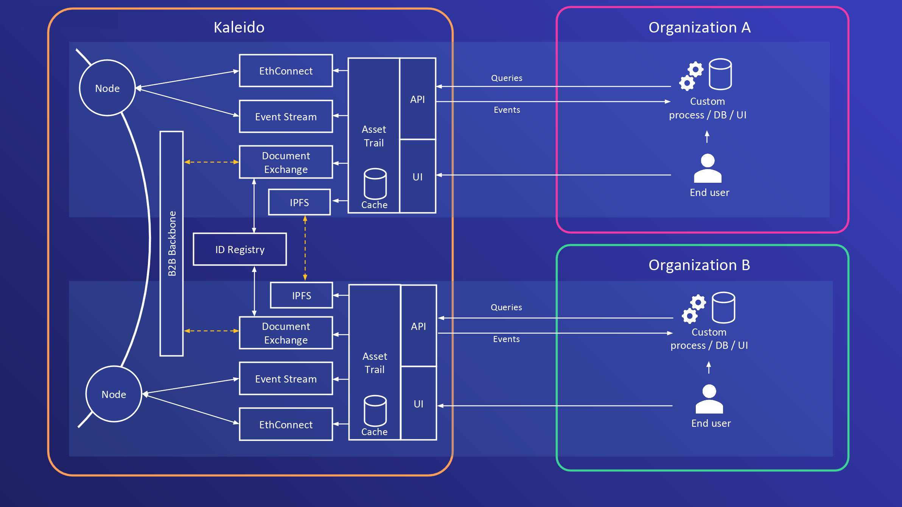

# Kaleido Asset Trail



## Kaleido Environment Setup

Kaleido Asset Trail is currently only supported on the Ethereum backend.

It requires a deployed instance of the [Asset Trail smart contract](solidity_new/contracts/AssetTrail.sol),
and one each of the following runtimes:
* IPFS
* App2App Messaging (with 2 destinations representing KAT and the client)
* Document Exchange (with 1 destination)

You must also define an Event Stream with subscriptions to all relevant
events for your use case (subscribe to all events if unsure).

## Running Locally

To run an instance of the application, you will require Node.js (`nodemon` also recommended) and MongoDB.

Edit one of the configuration files in [core/data](core/data), or create a new folder for your config.
Populate `config.json` with the URLs for the deployed contract API, the event stream, the IPFS/App2App/Document
Exchange runtimes, a valid set of credentials, and the locally running MongoDB.

You can create separate config folders for each org you wish to simulate.

Run the server with the following (substitute the path to your own data directory as needed):
```
cd core
DATA_DIRECTORY=data/single-region/OrgA nodemon
```

If using Visual Studio Code, there is also a provided [.vscode/launch.json](launch.json) file which can be
edited to add launch configurations to the UI.
